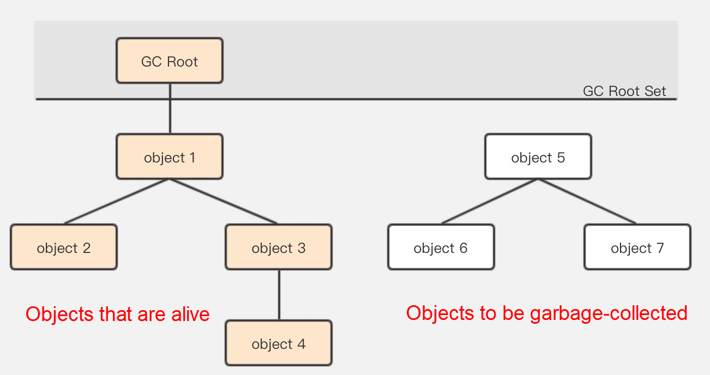

# 가비지 컬렉터와 메모리 할당 전략
* 메서드 진입하고 빠져나올때 스택 메모리에 스택 프레임을 푸시하고 팝한다.
* 스택 메모리에 스택 프레임은 메모리 크기는 기본적으로 클래스가 만들어 질때 거의 결정된다.
* 그렇기 때문에 이 영역의 메모리 할당과 회수는 결정적이라서 어떻게 회수할지 고민 하지 않아도 된다.
* 반면 힙과 메서드 영역은 다르다.
* 프로그램이 어떤 객체를 생성할지, 얼마나 많이 만들지는 런타임에만 알 수 있다.
* 그래서 이 메모리 영역들의 할당과 회수는 동적으로 이루어짐
* 가비지 컬렉터는 바로 이 영역을 관리하는데 집중한다.

## 3.2. 대상이 죽었는가?
* 가비지 컬렉터가 힙을 청소하려면 가장 먼저 어떤 객체가 살아 있고, 또 어떤 객체가 죽었는지 판단해야 한다.

### 3.2.1 참조 카운팅 알고리즘
* 많은 곳에서 객체가 살아 있는지 판단하는 알고리즘을 다음과 같이 설명하고 있다.
    1. 객체를 가리키는 참조 카운터를 추가한다. 참조를 하는곳이 하나 늘어날 때마다 카운터 값을 1씩 증가 시킨다.
    2. 참조하는 곳이 하나 사라질 때마다 카운터 값을 1씩 감소시킨다.
    3. 카운터 값이 0이 된 객체는 더는 사용될 수 없다.

* 하지만 자바에서는 참조 카운팅을 사용하지는 않는다.
* 예를 들어 참조 카운팅 알고리즘은 순환 참조 문제를 풀기 어렵다.
* 아래 예제는 참조 카운팅이 0이 아니어도 인스턴스가 회수되는것을 보여주는 예제이다.

* vm 옵션 : -Xlog:gc -XX:+PrintGCDetails 
* 테스트 코드 : [ReferenceCountingGC](../Digging-Deep-Into-The-JVM/jvm/src/ch03/ReferenceCountingGC.java)

* 결과
```
[0.007s][info   ][gc] Using G1
...
[0.048s][info   ][gc,phases,start] GC(0) Phase 1: Mark live objects
[0.048s][info   ][gc,phases      ] GC(0) Phase 1: Mark live objects 0.451ms
[0.048s][info   ][gc,phases,start] GC(0) Phase 2: Prepare for compaction
[0.048s][info   ][gc,phases      ] GC(0) Phase 2: Prepare for compaction 0.305ms
...
[0.050s][info   ][gc             ] GC(0) Pause Full (System.gc()) 14M->8M(80M) 2.275ms
...

```

*  14M->8M을 보아 메모리에서 회수가 된 것을 알 수 있다.
* 즉 자바 가상 머신은 객체 생사 판단에 참조 카운팅 알고리즘을 사용하지 않음을 알 수 있다.


### 3.2.2 도달 가능성 분석 알고리즘
* 오늘날의 주류 프로그래밍 언어들은 대부분 객체 생사 판단에 ```도달 가능성 분석``` 알고리즘을 사용한다.
* GC 루트라고 하는 루트 객체들을 시작 노드 집합으로 사용
* 시작 노드들에서 출발하여 참조하는 다른 객체들로 탐색해 들어감



* 자바에서 GC 루트로 이용할 수 있는 객체는 정해져 있음
    * 가상 머신 스택에서 참조 하는 객체 : 현재 실행중인 메서드에서 쓰는 매개 변수,지역변수,임시변수 등
    * 메서드 영역에서 클래스가 정적 필드로 참조하는 객체 : 자바 클래스의 참조 타입 정적 변수
    * 메서드 영역에서 상수로 참조되는 객체: 문자열 테이블 안의 참조 
    * 네이티브 메서드 스택에서 JNI(네이티브 메서드)가 참조하는 객체=
    * 자바 가상 머신 내부에서 쓰이는 참조 : 기본 데이터 타입에 해당하는 Class 객체, 일부 상주 예외 객체, 시스템 클래스 로더
    * 동기화 락으로 잠겨있는 모든 객체
* 이렇게 해서 전체 GC 루트 집합이 만들어 진다.