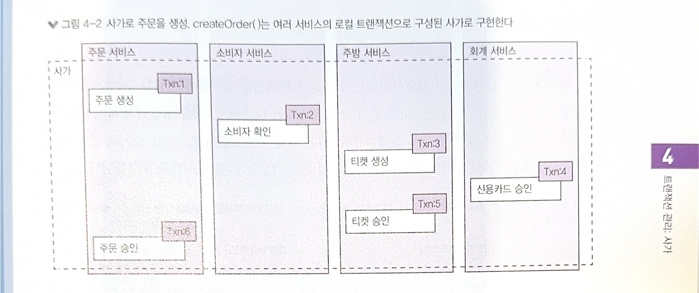
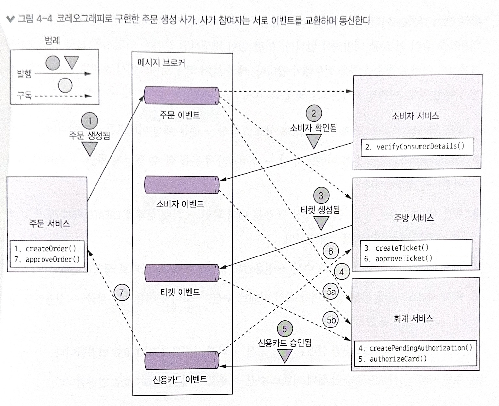
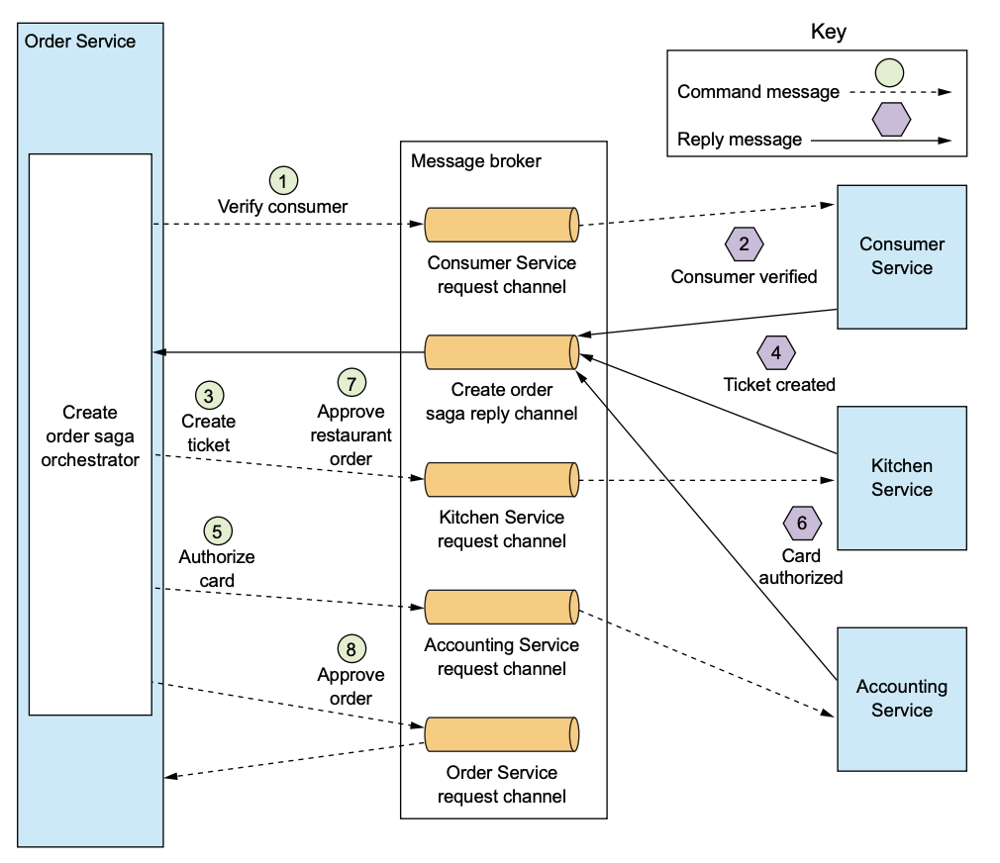
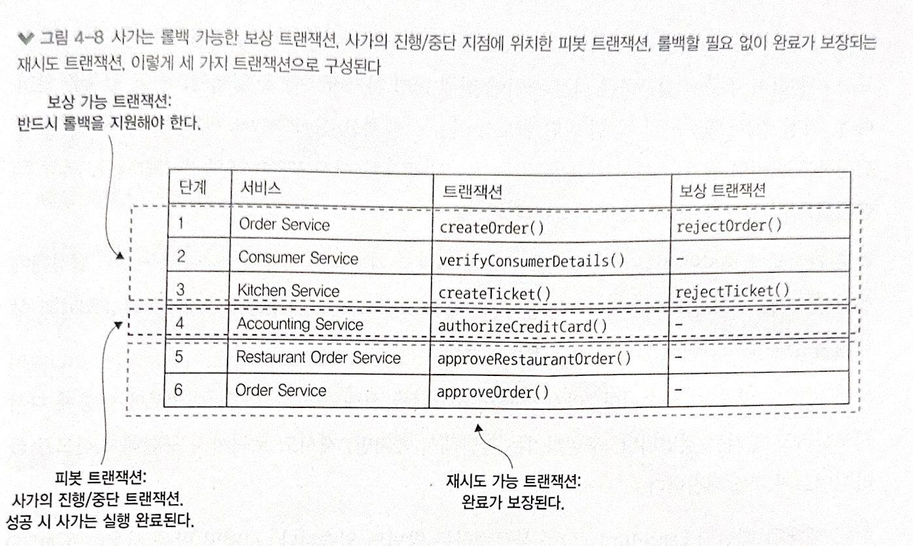

# 2024-12-09

# 4. 트랜잭션 관리: 사가

* 마이로서비스 아키텍처(이하 MSA) 에서도 단일 서비스 내부의 트랜잭션은 ACID가 보장하지만, 여러 서비스의 데이터를 업데이트하는 트랜잭션은 구현하기가 까다로움
* ACID 트랜잭션 대신 사가방식의 트랜잭션을 사용
* 사가는 I가 빠진 ACD 만 지원하기 때문에 추가로 다른 설계 기법을 추가해야 함

> **사가가 왜 I(격리성)가 빠진 ACD(원자성, 일관성, 지속성)만 지원하는 걸까?**
>
> * 고립성이란 각기 다른 트랜잭션에서 중간 결과나 상태에 영향을 받지 않고 개별로 실행되어야 한다는 것.
>
> * 예를 들어 A + B 작업이 묶여 있는 작업이 있을때 A 단계가 끝나면 `A 작업 완료` 라는 결과가 반영되고, 실제 A 단계는 완료 상태로 변경됩니다.
>
> * 다음은 B 작업이지만 실제로 A 작업 완료 직후가 아닌 조금 시간이 지난 뒤에 처리 된다고 가정합니다.
>
> * 이때 누군가가 A 작업을 조회하면 ‘A 작업은 성공했네?’ 라고 사가 전체가 끝나지 않았는데 중간 상태를 볼 수 있습니다.
>
> * 만약 B 작업이 실패한다면 A 작업도 취소해야 하지만 A 작업 취소 전까지 잠시나마 A 작업 완료 상태가 외부에 노출됩니다.
>
> * 전통적인 격리성에서는 두 작업 모두 완료 하거나 실패하기 전까지 그 중간상태를 볼 수 없었지만 사가 패턴에서는 각 단계가 로컬 트랜잭션으로 커밋되기 때문에 다른 곳에서 그  변경을 볼 수 있게 됩니다.


## 4.1. MSA 에서의 트랜잭션 관리

### 4.1.1. 분산 트랜잭션의 필요성

* createOrder 작업을 예시로 설명
* 주문이 가능한 소비자인지 확인 / 주문 내역 확인 / 신용카드 승인 / 주문 생성 등에 작업이 하나의 트랜잭션으로 관리 필요
* 모놀리식이라면 쉽지만 MSA 에서는 서비스 마다 존재하는 DB 데이터의 일관성을 유지 해야함

### 4.1.2. 분산 트랜잭션의 문제점

* 예전에 사용하던 여러 분산 트랜잭션 솔루션에서는 2단계 커밋(2PC)을 이용하여 전체 트랝개션 참여자가 반드시 커밋 아니면 롤백을 하도록 보장했음

> 2단계 커밋이란?
>
> * 분산된 여러 DB나 서비스가 하나의 트랜잭션을 모두 성공적으로 커밋하거나, 모두 함께 롤백하는 하는 방법입니다.
>
> * **1단계 (준비단계)** : 중앙 조정자가 각각의 참여 노드에게 “커밋할 준비가 되었냐”고 묻고, 모두 “예”라고 답하면 다음 단계로 갑니다. 한 곳이라도 “아니요”라면 바로 전체 롤백.
>
> * **2단계(커밋단계)**: 모든 참여자가 “예”라고 했다면 이제 조정자가 “실제로 커밋해”라고 지시하고, 참여자들은 실제 커밋을 수행해 최종 반영합니다.
>
> * 결국 “다 같이 OK면 커밋, 하나라도 NO면 모두 롤백”하는 절차를 2단계에 걸쳐 나눈 것입니다.
>

* 문제는 최신 NoSQL, 메시지 브로커 등은 분산 트랜잭션을 지원하지 않음
* 동기 IPC 형태라 가용성이 떨어짐
* 그렇기 때문에 `느슨한 결합 + 비동기`  를 토대로 다른 메커니즘이 필요함. 이것이 사가 패턴

### 4.1.3. 데이터 일관성 유지 : 사가 패턴

* 여러 서비스의 데이터를 업데이트 하는 시스템 커맨드 (주문, 예약 등등) 마다 사가를 하나씩 정의
* 사가는 일련의 로컬 트랜잭션이므로, 각 서비스별로 로컬 트랜잭션을 사용하여 데이터를 업데이트
* 사가와 기존 ACID트랜잭션은 두가지 중요한 차이점이 있음
    * 격리성이 사가에는 없음
    * 로컬 틀내잭션마다 변경분을 커밋하므로 보상 트랝개션을 걸어 롤백해야 함

**예제: 주문 생성 사가**

* 최초 로컬 트랜잭션은 외부 요청에 의해 시작되며, 나머지 5개의 로컬 트랜잭션은 자신의 선행 트랜잭션이 완료되면 트리거 됩니다.


* 서비스는 로컬 트랜잭션이 완료되면 메시지를 발행하여 다음 사가단계를 트리거함
* 메시지를 통해 사가 참여자를 느슨하게 결합하고 사가가 반드시 완료되도록 보장함

**사가는 보상 트랜잭션으로 변경분을 롤백한다**

* DB에서 롤백하면 그 시점까지 모두 언두 되듯이, 사가에서도 앞에 단계에 대한 명시적 언두가 필요함. 보상 트랜잭션을 미리 작성해둬야 함
* 보상 트랜잭션을 실행할 때 실행한 트랜잭션의 역순으로 실행, 다음 보상 트랜잭션을 트리거함
* 단계에 따라 보상 트랜잭션이 필요 없는 경우도 있음
    * 일기 전용인 트랜잭션 단계
    * 항상 성공하는 단계 다음에 이어지는 피봇 트랜잭션 단계

> **절대로 실패하지 않는 단계란?**
> * 피봇 트랜잭션 : 피봇 트랜잭션은 사가 흐름에서 더 이상 뒤로 돌릴 수 없는 전환점 역할을 합니다. 이 전환점은 성공적으로 마치면 사가가 사실상 확정 상태로 넘어가며, 그 이후는 재시도 가능한 단계나 이미 확정된 상태라 되돌릴 필요가 없습니다.
> 
> * 이 피봇 단계에 진입하기 전까지 이미 실패 가능성이 있는 단계들은 모두 마친 상태이거나, 실패했다면 이미 그 시점에서 사가가 보상되고 중단되었어야 한다는 뜻입니다
> 
> * 사가의 진행/중단 지점입니다. 피봇 트랜잭션이 커밋되면 사가는 완료될 때 까지 실행되니다.
> * 피봇 트랜잭션은 자체적으로 “보상할 단계”가 아니라 “성공하면 앞으로 진행, 실패하면 뒤로 돌아가야 하는” 결정점입니다.

* 에제를 기반으로 트랜잭션과 보상 트랜잭션 실행을 이야기 해보면
    * createOrder() 실행
    * verifyConsumerDetails() 실행 
    * createTicket() 실행
    * authorizeCreditCard() 실패
    * rejectTicket() 실행 - createTicket 트랜잭션과 짝이됨
    * rejectOrder() 실행 - createOrder 트랜잭션과 짝이됨
    

## 4.2. 사가 편성

* 첫 번째 사가 참여자를 정하고 로컬 트랜잭션 실행을 지시하고, 트랜잭션이 완료되면 그 다음 사가 참여자를 호출하는 과정이 모든 단계가 완료 될 때까지 반복
* 도중 하나라도 로컬 트랜잭션이 실패하면 사가는 보상 트랜잭션을 역순으로 실행.
* 이런 과정을 사가 편성이라고 함
* 사가는 두가지 종류가 있음
    * **코레오그래피** : 의사 결정과 순서화를 사가 참여자게 맡김, 주로 이벤트 교환방식으로 통신
    * **오케스트레이션** : 사가 편성 로직을 사가 오케스트레이터에 중앙화 함. 사가 참여자에게 커맨드 메시지를 보내 수행할 작업을 지시

### 4.2.1 코레오그래피 사가
* 사가 참여자가 할 일을 알려 주는 중앙 편성자가 없음, 참여자가 서로 이벤트를 구독해서 동작

**주문 생성 사가 구현: 코레오그래피 스타일**

* 피봇 트랜잭션인 ```5. authorizeCard()``` 단계를 기준으로 상태를 설정함
* 실패 이벤트가 발행되는 경우에는 보상 트랜잭션을 가동하여 이미 수행한 작업을 언두함
* 주방서비스, 주문 서비스 에서 신용카드 승인 실패 이벤트를 수신하고, 보상 트랜잭션으로 티켓과 주문을 rejected로 변경함

**확실한 이벤트 기반 통신**
* 코레오그래피 방식으로 사가를 구현하려면 두가지를 고려해야함
* 첫째, DB 트랜잭션의 일부로 이벤트 발행도 보장 되어야 함. 이 작업은 트랜잭셔널 메시징을 사용함
* 둘째, 자신이 수신한 이벤트와 자신이 가진 데이터를 연관 지을 수 있어야 함, 데이터를 매핑할 수 있도록 다른 사가 참여자가 상관관계 ID가 포함된 이벤트를 발행해야 함

**코레오그래피 사가의 장단점**
* 장점
    * 단순함 : 비즈니스 객체를 생성, 수정, 삭제할 때 서비스가 이벤트를 발행함
    * 느슨한 결함: 참여자는 이벤트를 구독할 뿐 서로를 알지 못함
* 단점
    * 이해하기 어렵다
        * 사가를 어느 한곳에 정의한 것이 아니라서 여러 서비스에 구현 로직이 흩어져 있음
        * 전체 사가 로직이 하나의 중앙 집중된 곳에 정의되어 있지 않고 각 서비스 코드에 ```도메인 로직 + 사가 이벤트 발행 로직```이 흩어져 있어 흐름을 파악하기 어려움
    * 서비스 간 순환 의존성
        * 참여자간 순환 의존성이 발생하기 쉬움, 순환 의존성은 잠재적인 설계 취약점
    * 단단히 결합될 위험성
        * 자신에게 영향을 미치는 이벤트를 모두 구독해야함
        * 스키마적으로도 단단히 묶일 수 있음
* 복잡한 사가는 오케스트레이션 방식이 적합

### 4.2.2 오케스트레이션 사가
* 사가 참여자가 할 일을 알려주는 오케스트레이터 클래스를 정의
* 사가 오케스트레이터는 커맨드.비동기 응답 상호 작용을 하여 참여자와 통신
* 참여자가 작업을 마치고 응답 메시지를 오케스트레이터에 주면, 오케스트레이터는 응답 메시지를 처리한 후 다음 사가 단계를 어느 참여자가 수행할지 결정함

**주문 생성 사가 구현: 오케스트레이션 스타일**

> 번역본과 다른점
>
> 소비자 서비스 응답 채널 -> Consumer Service request channel
> 주문 생성 사가 응답 채널 생성 -> Create order sage reply channel



* 각 서비스는 커맨드 메시지를 받고, 주문 서비스가 응답 메시지를 읽을 수 있도록 주문 생성 사가 응답 채널에 메시지를 발행합니다.
* 주문 사가 오케스트레이터는 자신의 응답 채널(Create order saga reply channel) 에서 메시지를 읽어 다음 사가 단계를 결정합니다.
* 마지막 단계에서 사가 오케스트레이터는 커멘드 메시지를 주문 서비스에 전송함
* 일관성 차원에서 주문 생성 서비스 또한 독립적인 참여자로 취급

**사가 오케스트레이터를 상태 기계로 모델링**

* 로컬 트랜잭션이 완료되면 상태 전이가 발생하고, 그 결과에 따라 다음 상태와 조치를 결정한다.
* 티켓 생성 상태 -> 신용카드 승인(주방 서비스가 티켓 생성 성공)상태 또는 주문 거부됨 (주방 서비스가 티켓 생성 실패)상태로 전이 됨

**사가 오케스트레이션과 트랜잭셔널 메시징**
* 오케스트레이션 기반 사가에서는 각 서비스가 데이터베이스를 갱신하고 메시지를 발행하는 과정을 거친다.
* 오케스트레이터는 이 응답들을 받아 다음 단계를 지시한다, 이때 데이터베이스 변경과 메시지 발행을 원자적으로 처리하기 위해 트랜잭션 메시징을 사용해야 한다.

**오케스트레이션 사가의 장단점**

* 장점
    * 의존 관계 단순화 : 오케스트레이션만 참여자를 호출하고, 참여자는 오케스트레이터를 호출하지 않음으로 순환 의존성이 발생하지 않음
    * 낮은 결합도 : 각 서비스는 오케스트레이터가 호출하는 api를 구현할 뿐, 사가 참여자가 발행하는 이벤트는 몰라도 됨
    * 관심사를 분리하고 비즈니스 로직을 단순화 : 다른 참여자를 모르기 때문에 사가 편성 로직에 대해서 신경 쓰지 않아도 됨
* 단점
    * ```똑똑한 오케스트레이터``` 하나가 ```깡통 서비스```에 일일이 할 일을 지시하는 모양새가 될 수 있음

## 4.3. 비격리 문제 처리
* ACID의 격리성은 동시에 실행중인 여러 트랜잭션 결과가 어떤 순서대로 실행된 결과와 동일함을 보장하는 속성입니다.
* 사가는 이 부분이 빠져있어 ACD 트랜잭션으로 봐야함
    * 원자성 : 트랜잭션을 모두 완료하거나 모든 변경분을 언두해야 함 (보상 트랜잭션으로 가능)
    * 일관성 : 서비스 내부의 참조 무결성은 로컬 DB가, 여러 서비스에 걸친 참조 무결성은 서비스가 처리(각 서비스 동기화를 통해 서비스 전체적인 데이터 일관성을 유지)
    * 지속송 : 로컬 DB로 처리

### 4.3.1 비정상 개요
* 소실된 업데이트 : 한 사가의 변경분을 다른 사가가 미처 못 읽고 덮어 씀
* 더티 읽기 : 사가 업데이트를 하지 않는 변경분을 다른 트랜잭션이나 사가가 읽을 수 있음
* 퍼지/반복 불가능한 읽기 : 한 사가의 상이한 두 단계가 같은 데이터를 읽어도 결과가 달라지는 현상. 다른 사가가 그 사이 업데이트를 했기 때문에 생기는 문제입니다.

**소실된 업데이트**
* 소실된 업데이트는 한 사가의 변경분을 다른 사가가 덮어 쓸 때 일어납니다.
    1. 주문 생성 사가 첫 번째 단계에서 주문을 생성
    2. 사가 실행 중 주문 취소 사가가 주문을 취소
    3. 주문 생성 사가 마지막 단계에서 주문을 승인
* 결국은 주문이 완료됨

**더티 읽기**
* 더티 읽기는 한 사가가 업데이트 중인 데이터를 다른 사가가 읽을 때 발생
* 예제에서와 같이 주문 생성 사가에서 주문 취소 사가가 늘려둔 잔고를 읽음으로써 더 비싼 주문을 완료 할 수도 있음

### 4.3.2 비격리 대책
* 시멘틱 락 : *_PENDING 상태를 두는 것과 같이 애플리케이션 수준의 락
* 교환적 업데이트 : 업데이트 작업은 어떤 순서로 실행해도 되게끔 설계
* 비관적 관점 : 사가 단계 순서를 재조정하여 비즈니스 리스크를 최소화 함
* 값 다시 읽기: 데이터를 덮어 쓸 때 그 전에 변경된 내용은 없는지 값을 다시 읽고 확인하여 더티 쓰기 방지
* 버전 파일: 순서를 재조정할 수 있게 업데이트를 기록
* 값에 의한 : 요청별 비즈니스 위험성을 기준으로 동시성 메커니즘을 동적 선택함

**사가의 구조**
* 사가는 다음 세 가지 트랜잭션으로 구성
    * 보상 가능 트랜잭션 : 보상 트랜잭션으로 롤백 가능한 트랜잭션
    * 피봇 트랜잭셔 : 사가의 진행/중단 지점. 피봇 트랜잭션이 커밋되면 사가는 완료될 때까지 실행
    * 재시도 가능 트랜잭션 : 피봇 트랜잭션 직후의 트랜잭션. 반드시 성공


* 보상 가능 트랜잭션은 자신을 언두 할 수 있는 보상 트랜잭션을 가지고 있음
* 피봇 트랜잭션이 완료되면 이 사가는 반드시 완료

**대책 : 시멘틱 락**
* 보상 가능 트랜잭션 생성/수정하는 레코드에 무조건 플래그를 세팅하는 대책
* 플래그는 재시도 가능 트랜잭션(사가 완료) 또는 보상 트랜잭션(사가 롤백)에 의해 해제
* 상태 필드와 같은 데이터로 다른 사가가 특정 내용으 업데이트하고 있다고 알려줌
* 상태 필드 데이터를 변경할 수 없는 사가일 경우
    * 해당 사가를 실패 처리하고 클라이언트에 나중에 시도하라고 알림, 구현 간단
    * 락이 해제될 때까지 블로킹
* 같은 레코드를 업데이트하는 사가를 직렬화 하는 효과를 볼 수 있음

**대책 : 교환적 업데이트**
* 업데이트를 어떤 순서로도 실행 가능하게 설계하면 소실된 업데이트 문제를 방지할 수 있음
* 예를 들어 account의 출금과 입금은 교환적인 작업이다.
* 보상 트랜잭션은 단순히 계좌를 입금&출금 해서 업데이틀 언두하면 됨

> **예시?**
>
> **문제** 상황
> * Create Order Saga: 1000(고객 신용 한도)에서 100을 차감 (-100).
> * Cancel Order Saga: 1000(고객 신용 한도)에 50을 추가 (+50).   
> * 두 작업이 동시에 실행되며 중간 상태를 덮어써 최종 잔액이 잘못 계산될 수 있음.   
> 예:  
>     * Create Order: 1,000 → 900   
>     * Cancel Order: 1,000 → 1,050   
>     * 최종 결과: 중간 상태 덮어쓰기 발생 → 데이터 불일치.   
> 
> **해결 방법**
> 1. 금액만 전달:   
>     * Create Order Saga: -100 전달.   
>     * Cancel Order Saga: +50 전달.   
>     * 잔액은 전달하지 않고, **주문 서비스(Order Service)** 가 로컬 데이터베이스에서 관리.   
> 2. 로컬 트랜잭션 활용:   
>     * 주문 서비스가 트랜잭션 내에서 잔액 업데이트 처리:   
>          * 잔액 = 기존 잔액 + 전달된 금액 수행.    
>     * 트랜잭션은 작업을 직렬화하여 처리 → 데이터 정합성 보장.     
> 
> **교환 가능한 설계를 적용하지 못하는 경우**   
> * 교환 가능 연산이 적용되지 않는 작업은 순서를 보장해야 합니다.   
>     * 예를 들어, 승인(Authorize) → 취소(Cancel)의 경우 순서가 매우 중요합니다 
>         * 승인 → 취소는 문제없지만,
>         * 취소 → 승인은 모순된 상태를 유발할 수 있습니다. 


**대책: 비관적 관점**
* 더티 읽기로 인한 비즈니스 리스크를 최소화 하기 위해 사가 단계의 순서를 재조정 하는 것
* 취소 사가 단계에서 신용잔고를 조정하는 단계를 마지막으로 보내면 더티 읽기 위험을 낮출 수 있음
* 보상 가능 트랜잭션은 보상 트랜잭션에 의해 데이터가 변경 될 수 있는데, 이런 가능성을 제거하고 재시도 가능 트랜잭션으로 변경하면 더티 읽기 가능성은 사라짐
* 예시에서는 신용 한도 증가가 사가의 마지막 단계로 이동했기 때문에, 이 단계에서는 더 이상 보상*(롤백)을 고려하지 않아도 됨.

**대책: 값 다시 읽기**
* 값 다시 읽기는 소실된 업데이트를 방지하는 대책
* 업데이트 하기 전에 값을 다시 읽어 값이 변경되지 않았는지 확인

**대책: 버전 파일**
* 레코드에 수행한 작업을 하나하나 기록하는대책
* 비교환적 작업을 교환적 작업으로 변환하는 방법
* 서비스는 요청을 순서대로 기록해두고 ``올바른`` 순서대로 실행하면 됨
    * ex) 승인 취소 요청이 먼저 있다면 뒤에 도착한 승인 요청은 무시

**대책: 값에 의한**
* 비즈니스 위험성을 기준으로 동시성 메커니즘을 선택함
* 위험하다면 분산 트랜잭션, 아니면 사가를 사용

## 4.4.